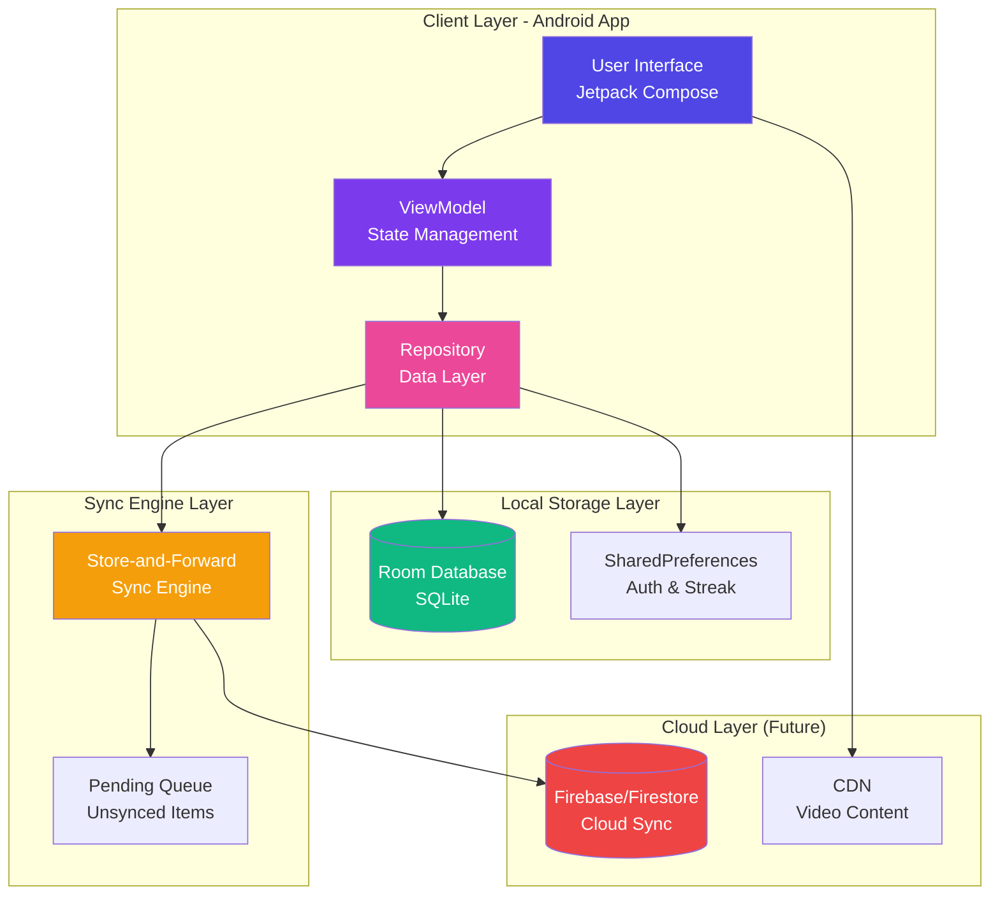
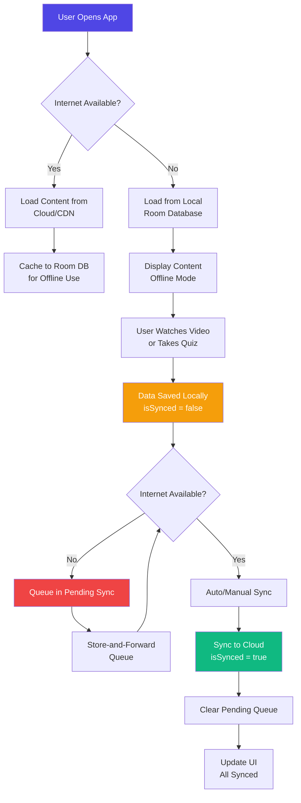
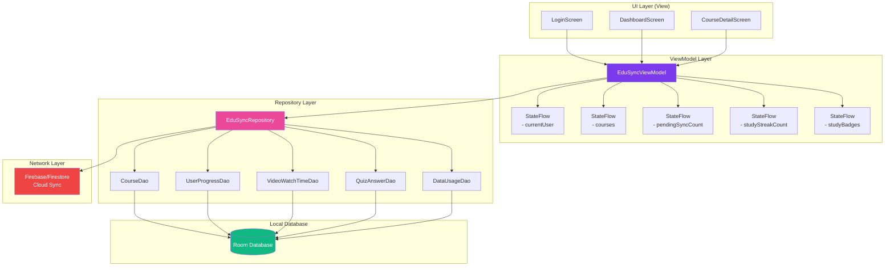
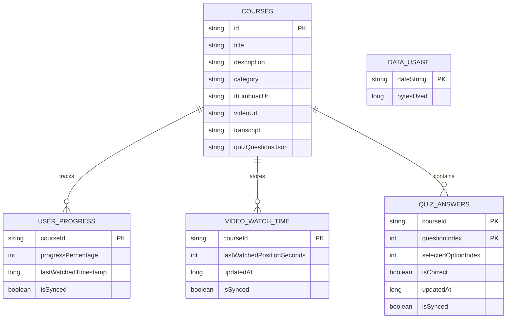
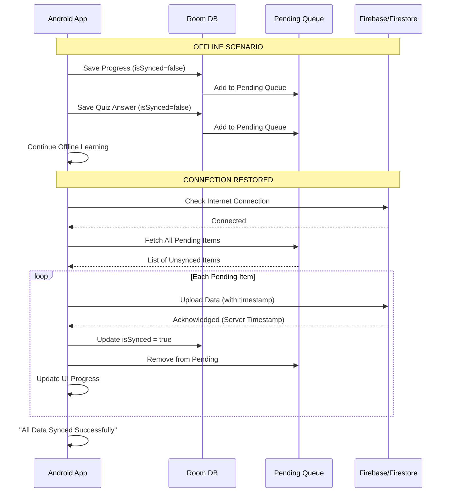
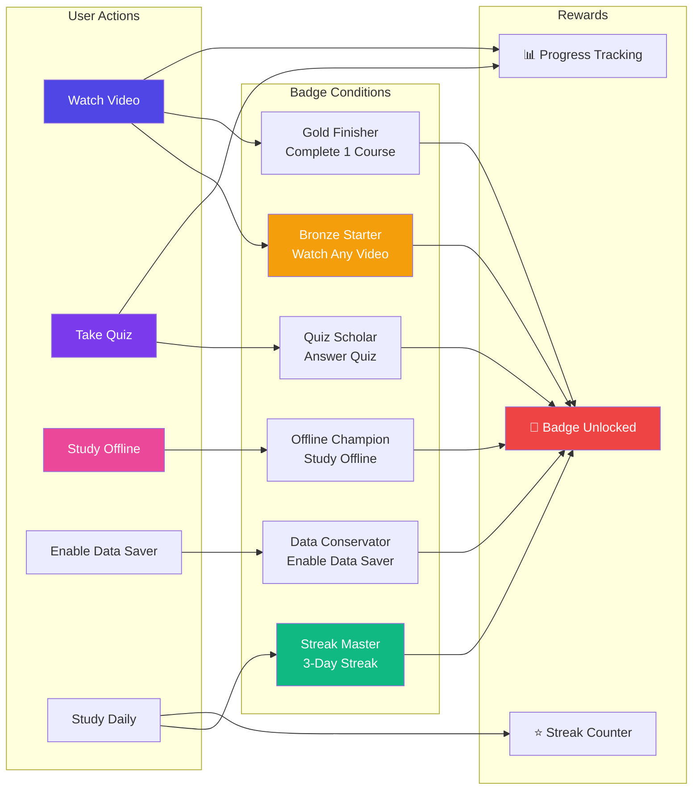
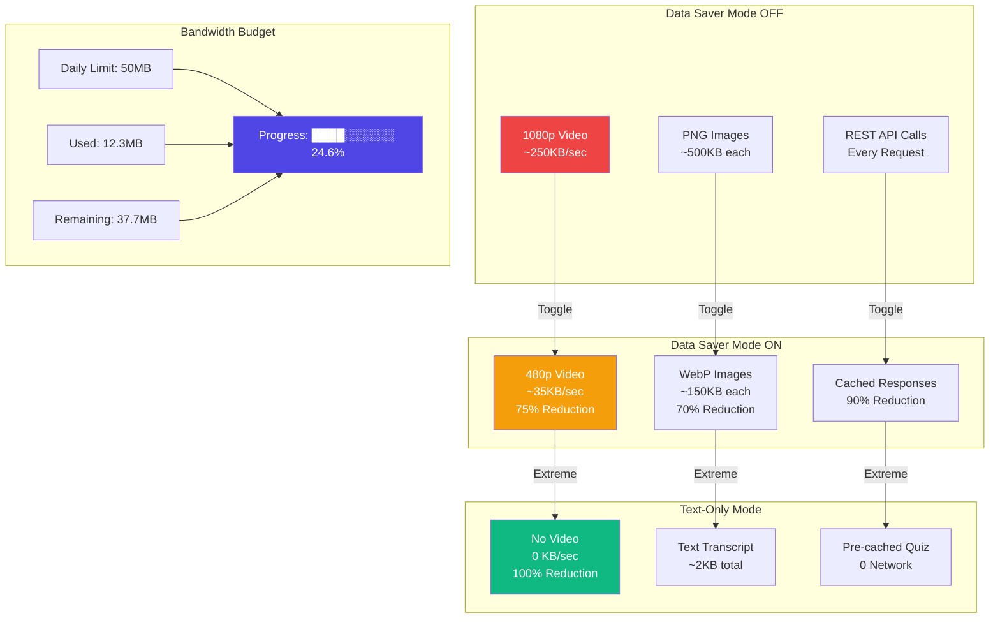
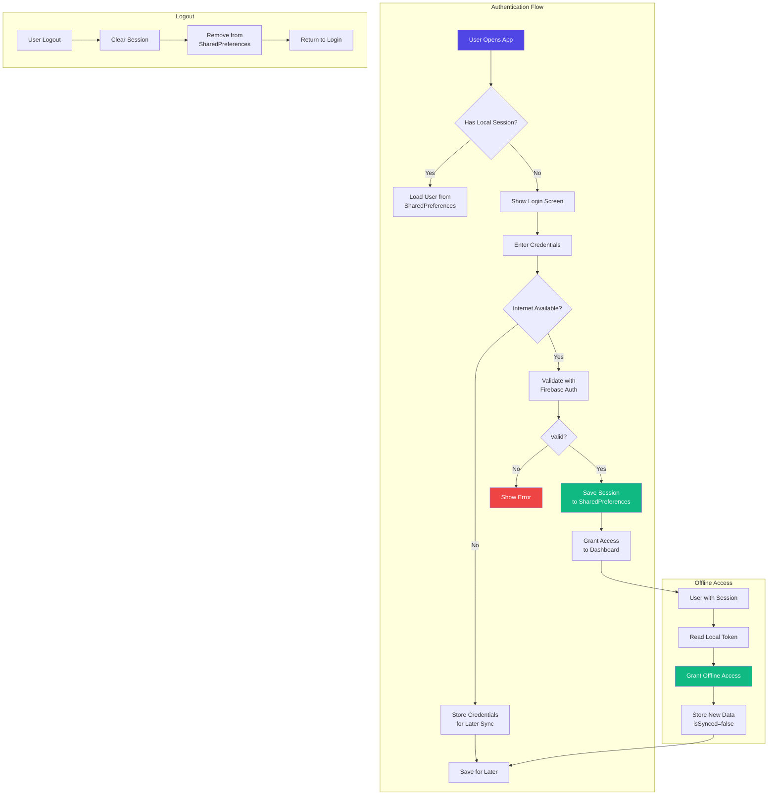
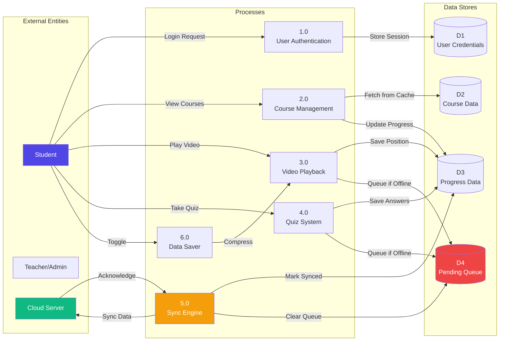
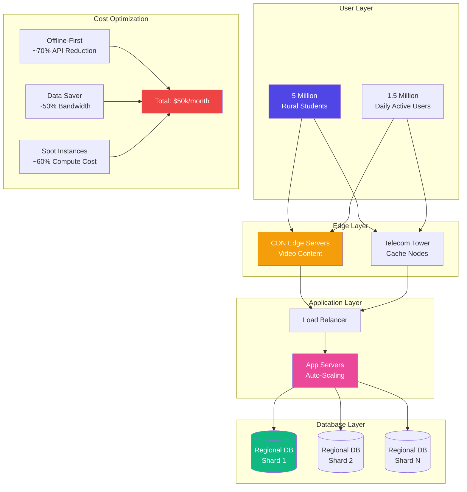

# 📚 EduSync - Offline-First Education Platform

<div align="center">
  


**"Learn Without Limits" - Education for Rural India's 5 Million Students**

[](#system-architecture) 
[](#features) 
[](#quick-setup) 
[](#system-design-diagrams)

</div>

---

## 📖 Overview

**EduSync** is an offline-first education platform designed for rural students in India with limited internet connectivity. Built with Jetpack Compose and Room database, it enables seamless learning even without network access, with intelligent store-and-forward synchronization.

### 🎯 Target Population
- **5 Million** rural students
- **1.5 Million** daily active users
- **$50,000/month** budget constraint
- **50MB** daily data limit

---

## ✨ Features

> **Click each feature to learn more**

<details>
<summary><b>📱 Offline-First Learning</b></summary>

All content is cached locally using Room Database. Students can:
- Watch videos without internet
- Complete assignments offline
- Access all course materials anytime
- Progress saved automatically
</details>

<details>
<summary><b>🔄 Store-and-Forward Sync</b></summary>

Intelligent sync engine that:
- Queues all offline activities
- Auto-syncs when connection detected
- Shows pending items count
- Uses last-write-wins conflict resolution
- Provides visual sync progress bar
</details>

<details>
<summary><b>🎬 Dynamic Quality Switching</b></summary>

Video quality options:
- **Auto** - Adaptive based on network
- **1080p** - HD quality
- **720p** - Standard HD
- **480p** - Data saver mode
- **Text-Only** - Zero bandwidth mode
</details>

<details>
<summary><b>📊 Data Minimization</b></summary>

Smart bandwidth management:
- 50MB daily budget tracker
- Data Saver toggle (70% reduction)
- Text-Only mode (100% reduction)
- Real-time usage monitoring
- Warning at 90% usage
</details>

<details>
<summary><b>🎮 Gamification System</b></summary>

Earn badges and track streaks:
- 6 achievement badges
- Daily study streak tracker
- 7-day visual calendar
- Badge details dialog
- Progress notifications
</details>

<details>
<summary><b>🔐 Resilient Identity</b></summary>

Offline authentication:
- Local session persistence
- Demo mode for instant access
- SharedPreferences token storage
- No internet required after first login
- Secure logout
</details>

---

## 🏗️ System Architecture

### High-Level System Architecture



---

### Offline-First Workflow



---

### MVVM Architecture Flow



---

## 🗄️ Database Schema

### Room Database Entities



---

## 🔄 Store-and-Forward Sync Engine

### Sync Sequence Diagram



---

## 🎮 Gamification System

### Badges & Achievements



### Available Badges

| Badge | Icon | Unlock Condition |
|-------|------|------------------|
| Bronze Starter | ⭐ | Watch any course video |
| Gold Finisher | ✅ | Complete 100% of any course |
| Quiz Scholar | ⚡ | Submit any quiz answer |
| Offline Champion | ☁️ | Study without internet |
| Data Conservator | 📶 | Enable Data Saver mode |
| Streak Master | ❤️ | 3+ day study streak |

---

## 📉 Data Minimization Strategy

### Bandwidth Optimization



---

## 🔐 Resilient Identity System

### Offline Authentication Flow



---

## 📊 Data Flow Diagram



---

## 🚀 Deployment & Scaling Strategy

### Production Architecture



---

## 🛠️ Quick Setup

### Prerequisites
- Android Studio Ladybug (2024.3.1) or newer
- JDK 11 or higher
- Android SDK API 35+

### Installation

1. **Clone the repository**
```bash
git clone https://github.com/kushalkumarj2006/EduSync.git
cd EduSync
```

2. **Open in Android Studio**
```bash
File → Open → Select project folder
```

3. **Sync Gradle**
```bash
File → Sync Project with Gradle Files
```

4. **Run the app**
```bash
Select Pixel 6 API 35+ → Click Run ▶
```

5. **Launch Demo Mode**
- Click **"Launch Demo Mode (Instant Login)"**
- App works 100% offline immediately!

---

## 🎯 System Constraints Addressed

| Constraint | Solution |
|------------|----------|
| **Offline-First** | Room DB + Store-and-Forward |
| **50MB Daily Data** | Data Saver + Text-Only Mode |
| **5M Users** | Edge caching + Sharding strategy |
| **$50k/month** | Offline-first reduces API costs |
| **Resilient Identity** | SharedPreferences auth |
| **Bandwidth Efficiency** | Dynamic quality switching |

---

## 📱 Screenshots

<div align="center">
  
| Login | Dashboard | Course Detail |
|-------|-----------|---------------|
|  |  |  |

| Video Player | Quiz | Streak & Badges |
|--------------|------|-----------------|
|  |  |  |

</div>

---

## 📚 Tech Stack Details

### Dependencies

```gradle
dependencies {
    // UI
    implementation(platform(libs.androidx.compose.bom))
    implementation(libs.androidx.compose.material3)
    implementation(libs.androidx.compose.ui)
    implementation(libs.androidx.activity.compose)
    
    // Database
    implementation(libs.androidx.room.runtime)
    implementation(libs.androidx.room.ktx)
    ksp(libs.androidx.room.compiler)
    
    // Networking
    implementation(libs.retrofit)
    implementation(libs.converter.moshi)
    implementation(libs.okhttp)
    implementation(libs.logging.interceptor)
    
    // Coroutines
    implementation(libs.kotlinx.coroutines.android)
    implementation(libs.kotlinx.coroutines.core)
    
    // Testing
    testImplementation(libs.junit)
    testImplementation(libs.robolectric)
    testImplementation(libs.androidx.compose.ui.test.junit4)
}
```

---

## 🧪 Testing

```bash
# Run unit tests
./gradlew test

# Run instrumented tests
./gradlew connectedAndroidTest

# Run Robolectric tests
./gradlew testDebugUnitTest
```

---

## 🚢 Deployment

### Build APK

```bash
# Debug build
./gradlew assembleDebug

# Release build (requires signing config)
./gradlew assembleRelease
```

### Build AAB (Play Store)

```bash
./gradlew bundleRelease
```

---

## 🤝 Contributing

1. Fork the repository
2. Create your feature branch (`git checkout -b feature/AmazingFeature`)
3. Commit your changes (`git commit -m 'Add some AmazingFeature'`)
4. Push to the branch (`git push origin feature/AmazingFeature`)
5. Open a Pull Request

---

## 📄 License

Distributed under the MIT License. See `LICENSE` for more information.

---

## 🙏 Acknowledgments

- **IEEE CS Bangalore Chapter** for System Siege 2026
- **Google** for Android development tools
- **JetBrains** for Kotlin and Compose
- **Open Source Community** for all the amazing libraries

---

## 📞 Contact

**Project Link:** [https://github.com/kushalkumarj2006/EduSync](https://github.com/kushalkumarj2006/EduSync)

---

<div align="center">
  
**Made with ❤️ for Rural India's Students**

[⬆ Back to Top](#-edusync---offline-first-education-platform)

</div>
